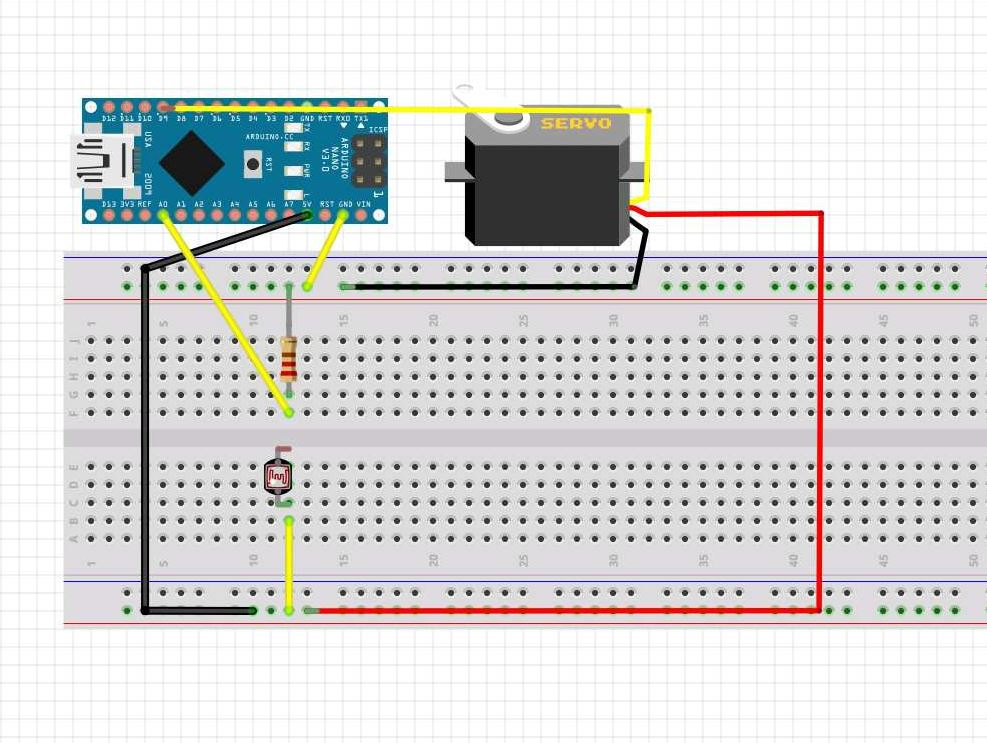

:Author: TimoWielink
:Date: 11/05/2019
:Revision: version 1.1
:License: Public Domain

= Project: Drone Release Light Sensor

This code is used to open a servo when it detects light from your drone. Connectd everything as shown in step 2.
U can use an Arduino Uno or Nano and the code would be the same. 

== Step 1: Installation

1. Open this file
2. Go to the Arduino Web editor to upload the code on your Arduino

== Step 2: Assemble the circuit

== Step 3: Load the code

Upload the code contained in this sketch on to your board

=== Folder structure

....
 sketch123                => Arduino sketch folder
  ├── sketch123.ino       => main Arduino file
  ├── schematics.png      => (optional) an image of the required schematics
  ├── layout.png          => (optional) an image of the layout
  └── ReadMe.adoc         => this file
....

=== License
This project is released under a {License} License.

=== Contributing
To contribute to this project please contact TimoWielink https://id.arduino.cc/TimoWielink

=== BOM
Add the bill of the materials you need for this project.

|===
| ID | Part name      | Part number | Quantity
| R1 | 10k Resistor   | 1234-abcd   | 10
| L1 | Red LED        | 2345-asdf   | 5
| A1 | Arduino Zero   | ABX00066    | 1
|===

=== Help
This document is written in the _AsciiDoc_ format, a markup language to describe documents.
If you need help you can search the http://www.methods.co.nz/asciidoc[AsciiDoc homepage]
or consult the http://powerman.name/doc/asciidoc[AsciiDoc cheatsheet]
